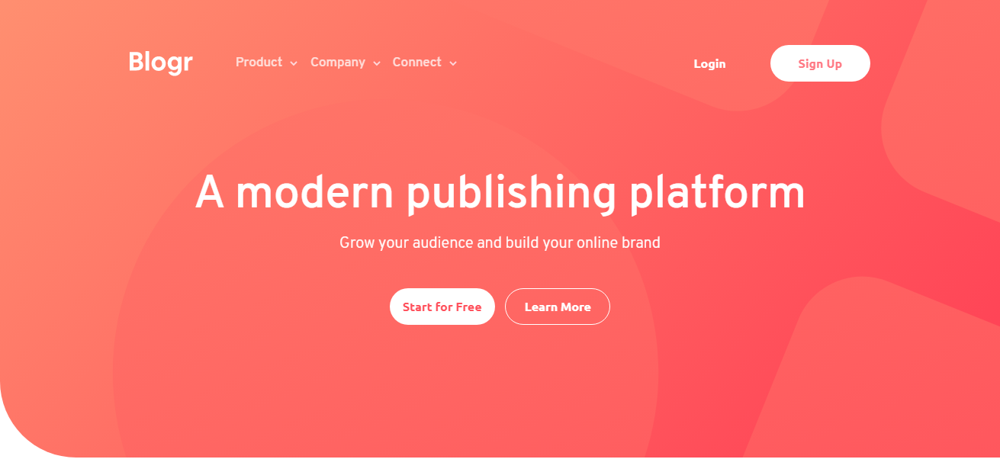
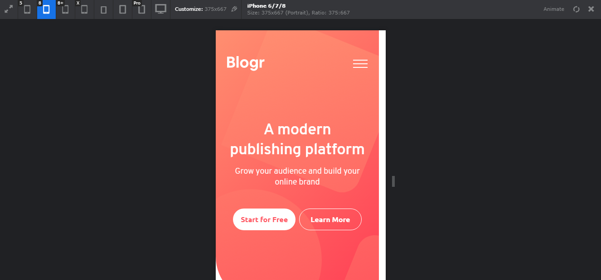

# Frontend Mentor - Blogr landing page solution

This is a solution to the [Blogr landing page challenge on Frontend Mentor](https://www.frontendmentor.io/challenges/blogr-landing-page-EX2RLAApP). Frontend Mentor challenges help you improve your coding skills by building realistic projects. 

## Table of contents

- [Overview](#overview)
  - [Screenshots](#screenshots)
- [My process](#my-process)
  - [Built with](#built-with)
  - [What I learned](#what-i-learned)
  - [Useful resources](#useful-resources)
- [Author](#author)
- [Acknowledgments](#acknowledgments)

## Overview

Front End Mentor é um site que disponibiliza desafios que tem como o objetivo a construção de layouts que eles mesmos criam. Para fazer a tela, você pode baixar o arquivo ZIP com as imagens e guia de paletas de cores, fontes e tamanhos de telas.

### Screenshots


#### Alguns prints mostrando a responsividade e uma parte do layout.







- Solution URL: [https://github.com/RaquelPenteado/blogr](https://github.com/RaquelPenteado/blogr)
- Live Site URL: [https://blogr-pied.vercel.app](https://blogr-pied.vercel.app)

## My process

### Built with

- Semantic HTML5 markup
- CSS custom properties
- Mobile-first workflow
- JS

### What I learned

Use this section to recap over some of your major learnings while working through this project. Writing these out and providing code samples of areas you want to highlight is a great way to reinforce your own knowledge.

To see how you can add code snippets, see below:

```css
.btn-menu {
  gap: 1.5%;
}
```

### Useful resources

- [https://pt.stackoverflow.com/questions/117634/mostrar-e-esconder-conteúdo-em-javascript-menu](https://pt.stackoverflow.com/questions/117634/mostrar-e-esconder-conteúdo-em-javascript-menu) - Também visitei um site que mostrava um jeito de abrir e fechar um menu com javascript, pois eu não estava conseguindo obter o resultado que queria.

## Author

- Frontend Mentor - [@yourusername](https://www.frontendmentor.io/profile/RaquelPenteado)
- Twitter - [@yourusername](https://www.twitter.com/raquelpenteado)

## Acknowledgments

[https://www.youtube.com/watch?v=gUdf1xlH0VM&list=PLmm0EZfIjQSgTmKt79kIeKiLZmDGWWihl](https://www.youtube.com/watch?v=gUdf1xlH0VM&list=PLmm0EZfIjQSgTmKt79kIeKiLZmDGWWihl) - Para aprender a fazer este tipo de layout, encontrei um vídeo no youtube que me ajudou a desenvolver e entender de uma maneira diferente.

[https://github.com/sergii-moroz/Blogr-landing-page](https://github.com/sergii-moroz/Blogr-landing-page) - E aqui está o repositório no github.
